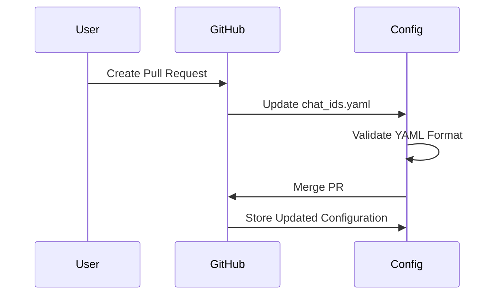
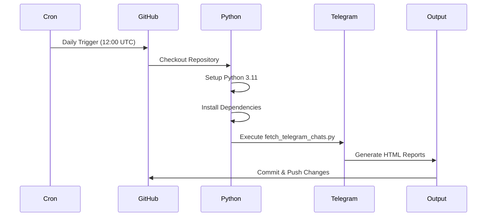

# CryptoTGScan - Telegram Chat Summarization System

This repository contains a GitHub Action pipeline for the Telegram Chat Summarization System, implementing **Milestone 1: Environment Setup & Basic Chat Fetch Verification**.

## 🎯 Project Overview

The system is designed to:
- Accept user-submitted Telegram chat IDs via pull requests
- Periodically fetch messages from these chats
- Utilize environment variables for secure API interactions
- Generate custom HTML pages per chat summarizing content (future milestones)

## 📋 Milestone 1 Deliverables

### ✅ 1. Environment Variable Configuration
- Securely configured Telegram API tokens via GitHub Action secrets
- Required environment variables: `TELEGRAM_API_ID`, `TELEGRAM_API_HASH`
- Uses API ID and hash approach (no bot token required)

### ✅ 2. Configurable Chat ID Management
- `chat_ids.yaml` configuration file in repository root
- Easy submission and merging of Telegram chat IDs through pull requests
- Example format:
```yaml
telegram_chat_ids:
  - 123456789
  - 987654321
```


### ✅ 3. Chat Fetching & Verification Script
- Modular Python script (`scripts/fetch_telegram_chats.py`)
- Reads chat IDs from config file
- Connects to Telegram API using API ID and hash
- Verifies access and basic retrieval capability for each listed chat
- Outputs verification results (Yes/No) for each chat ID

### ✅ 4. HTML Output Generation
- Generates `chat_verification.html` in the `/website` folder
- Summarizes verification results with clean, modern styling
- Includes summary statistics and detailed verification table

## 🚀 GitHub Action Setup

The repository includes a GitHub Action workflow located at `.github/workflows/cron-html-generator.yml` that:

- Runs daily at 12:00 UTC using cron syntax (`0 12 * * *`)
- Can be triggered manually via the GitHub Actions tab
- Generates HTML files with the current date as the title
- Verifies Telegram chat accessibility
- Saves files to the `./website` directory
- Automatically commits and pushes the generated files



## 🔧 Setup Instructions

### 1. Repository Secrets
Add the following secrets in your GitHub repository (Settings → Secrets and variables → Actions):

- `TELEGRAM_API_ID`: Your Telegram API ID
- `TELEGRAM_API_HASH`: Your Telegram API Hash

**Note:** No bot token is required - this uses the API ID and hash approach like your existing script.

### 2. Adding Chat IDs
To add new Telegram chat IDs:
1. Edit `chat_ids.yaml`
2. Add chat IDs to the `telegram_chat_ids` list
3. Create a pull request
4. Merge the PR to include the new chats in the verification process

### 3. Manual Testing

To test the scripts locally:

```bash
# Set environment variables
export TELEGRAM_API_ID=your_api_id
export TELEGRAM_API_HASH=your_api_hash

# Test the original HTML generator
python3 scripts/generate_html.py

# Test the Telegram chat verification
python3 scripts/fetch_telegram_chats.py
```

## 📁 File Structure

```
├── .github/workflows/
│   └── cron-html-generator.yml    # GitHub Action workflow
├── scripts/
│   ├── generate_html.py           # Original HTML generator
│   └── fetch_telegram_chats.py    # Telegram chat verification
├── website/                       # Generated HTML files
├── chat_ids.yaml                  # Chat ID configuration
├── requirements.txt               # Python dependencies
└── README.md                     # This file
```

## 🔍 Generated Reports

The system generates two types of HTML reports:

1. **Date-based HTML** (`index_YYYY-MM-DD.html`): Simple pages with current date
2. **Chat Verification Report** (`chat_verification.html`): Detailed verification results including:
   - Summary statistics
   - Chat ID accessibility status
   - Verification timestamps
   - Error messages for failed verifications
   - API configuration information

## 🏗️ Architecture

### Modular Design
- **TelegramChatVerifier**: Handles chat verification logic using API ID/hash
- **HTMLReportGenerator**: Manages HTML report generation
- **Configuration Management**: YAML-based chat ID management
- **Error Handling**: Comprehensive logging and error reporting

### Future-Proof Structure
- Clear separation of concerns
- Easy to extend for Milestone 2 (LLM integration)
- Modular classes for unit testing
- Environment variable-based configuration
- Compatible with pyrogram/telethon libraries

## 📅 Cron Schedule

The GitHub Action uses the cron expression `0 12 * * *` which means:
- `0` - At minute 0
- `12` - At hour 12 (noon UTC)
- `*` - Every day of the month
- `*` - Every month
- `*` - Every day of the week

## 🔮 Future Milestones

### Milestone 2: Basic LLM Integration
- Integrate LLM APIs securely via environment variables
- Implement basic summarization of chat messages
- Generate enhanced HTML pages per chat with summaries

### Milestone 3: Advanced Summarization Strategies
- Provide multiple summarization strategies
- Allow selection/configuration via the YAML file
- Enhanced visualizations and interactive elements on HTML pages

## 🛠️ Development

### Dependencies
```bash
pip install -r requirements.txt
```

### Local Development
1. Clone the repository
2. Set up environment variables locally (`TELEGRAM_API_ID`, `TELEGRAM_API_HASH`)
3. Run scripts for testing
4. Create pull requests for chat ID additions

### Testing
- All scripts include comprehensive logging
- Modular design enables easy unit testing
- Error handling for robust execution within GitHub Actions
- Compatible with existing pyrogram/telethon workflows
