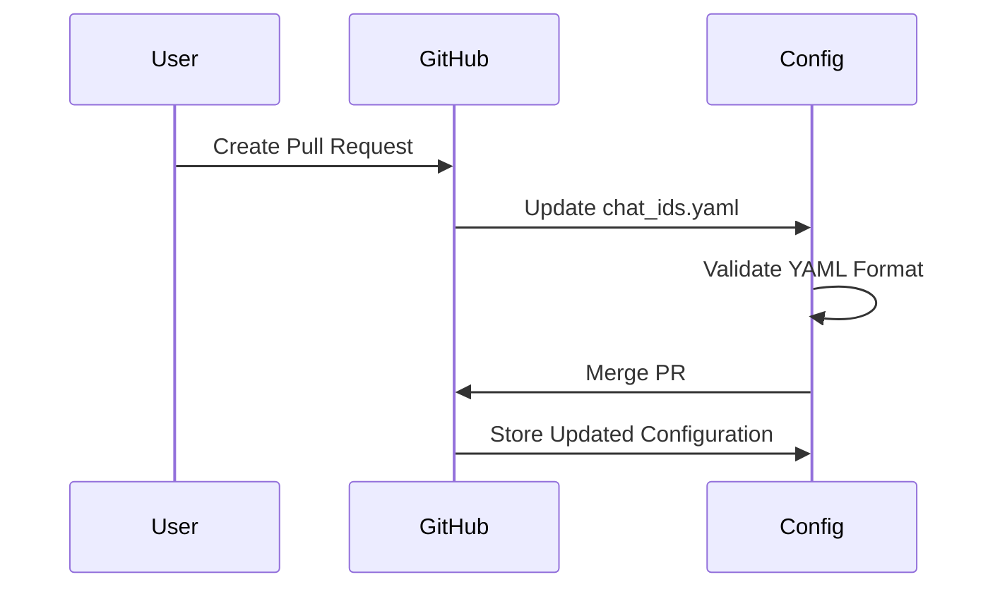
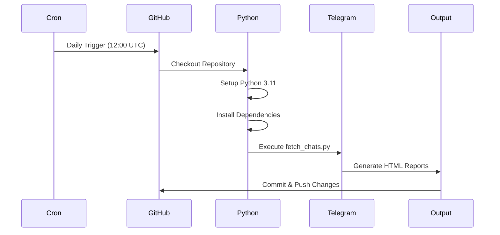

# CryptoTGScan - Telegram Chat Summarization System

This repository contains a GitHub Action pipeline for the Telegram Chat Summarization System, implementing **Milestone 1: Environment Setup & Basic Chat Fetch Verification**.

## 🎯 Project Overview

The system is designed to:
- Accept user-submitted Telegram chat IDs via pull requests
- Periodically fetch messages from these chats using pyrogram (like reference script)
- Utilize environment variables for secure API interactions
- Generate custom HTML pages per chat summarizing content (future milestones)

## 📋 Milestone 1 Deliverables

### ✅ 1. Environment Variable Configuration
- Securely configured Telegram API tokens via GitHub Action secrets
- Required environment variables: `TELEGRAM_API_ID`, `TELEGRAM_API_HASH`
- Uses pyrogram library with API ID and hash approach (no bot token required)

### ✅ 2. Configurable Chat ID Management
- `chat_ids.yaml` configuration file in repository root
- Easy submission and merging of Telegram chat IDs through pull requests
- Example format:
```yaml
telegram_chat_ids:
  - 123456789
  - 987654321
```


### ✅ 3. Chat Fetching & Verification Script
- Modular Python script (`scripts/fetch_chats.py`)
- Reads chat IDs from config file
- Connects to Telegram API using telethon (official Telegram client)
- Supports both API ID/hash and bot token authentication
- Verifies access and basic retrieval capability for each listed chat
- Outputs verification results with chat names and recent messages
- Exports raw message data to JSON files for analysis

### ✅ 4. HTML Output Generation
- Generates `chat_verification.html` in the `/website` folder
- Summarizes verification results with clean, modern styling
- Includes summary statistics and detailed verification table
- Enhanced with message dropdowns and detailed chat information

## 🚀 GitHub Action Setup

The repository includes a GitHub Action workflow located at `.github/workflows/cron-html-generator.yml` that:

- Runs daily at 12:00 UTC using cron syntax (`0 12 * * *`)
- Can be triggered manually via the GitHub Actions tab
- Generates HTML files with the current date as the title
- Verifies Telegram chat accessibility using pyrogram
- Saves files to the `./website` directory
- Automatically commits and pushes the generated files



## 🔧 Setup Instructions

### 1. Repository Secrets
Add the following secrets in your GitHub repository (Settings → Secrets and variables → Actions):

**Option A: Bot Token (Recommended for Automation)**
- `TELEGRAM_BOT_TOKEN`: Your Telegram Bot Token
- `TELEGRAM_API_ID`: Your Telegram API ID (required for bot tokens)
- `TELEGRAM_API_HASH`: Your Telegram API Hash (required for bot tokens)

**Option B: API ID and Hash**
- `TELEGRAM_API_ID`: Your Telegram API ID
- `TELEGRAM_API_HASH`: Your Telegram API Hash

**Note:** Bot tokens are recommended for automation as they don't require interactive authentication. However, bots have limited access and cannot fetch message history due to Telegram API restrictions. For full message history access, use API ID/hash authentication (user account).

### 2. Bot Setup Instructions

If using a bot token:

1. **Create a Telegram Bot:**
   - Message @BotFather on Telegram
   - Use `/newbot` command
   - Follow the instructions to create your bot
   - Save the bot token

2. **Add Bot to Chats:**
   - Add your bot to the Telegram chats/channels you want to monitor
   - Make sure the bot has permission to read messages
   - For channels, the bot needs to be an admin with read permissions

3. **Common Bot Access Issues:**
   - **"Peer id invalid"**: Bot is not added to the chat
   - **"CHAT_WRITE_FORBIDDEN"**: Bot lacks read permissions
   - **"CHAT_READ_FORBIDDEN"**: Bot needs admin rights in the chat

### 3. Adding Chat IDs
To add new Telegram chat IDs:
1. Edit `chat_ids.yaml`
2. Add chat IDs to the `telegram_chat_ids` list
3. Create a pull request
4. Merge the PR to include the new chats in the verification process

### 3. Manual Testing

To test the scripts locally:

```bash
# Set environment variables
export TELEGRAM_API_ID=your_api_id
export TELEGRAM_API_HASH=your_api_hash

# Test the original HTML generator
python3 scripts/generate_html.py

# Test the Telegram chat verification
python3 scripts/fetch_chats.py
```

## 📁 File Structure

```
├── .github/workflows/
│   └── cron-html-generator.yml    # GitHub Action workflow
├── scripts/
│   ├── generate_html.py           # Original HTML generator
│   ├── fetch_chats.py             # Telegram chat verification (pyrogram)
│   └── report.py                  # HTML report generation module
├── website/                       # Generated HTML files
├── chat_ids.yaml                  # Chat ID configuration
├── requirements.txt               # Python dependencies
└── README.md                     # This file
```

## 🔍 Generated Reports

The system generates enhanced HTML reports with the following features:

1. **Chat Verification Report** (`output_YYYY-MM-DD.html`): Detailed verification results including:
   - Summary statistics
   - Chat ID accessibility status
   - Verification timestamps
   - Error messages for failed verifications
   - API configuration information
   - Message dropdowns with recent chat content
   - Raw message data exported to JSON files

2. **Enhanced Features**:
   - Lists all available chats at startup
   - Fetches up to 2000 messages per chat (configurable)
   - Filters messages by date range (last 7 days by default)
   - Tracks participant activity and daily message counts
   - Exports raw message data to JSON for further analysis
   - Uses pyrogram's `get_chat_history()` API for efficient message retrieval

## 🏗️ Architecture

### Modular Design
- **TelegramChatVerifier**: Handles chat verification logic using pyrogram
- **HTMLReportGenerator**: Manages HTML report generation
- **Configuration Management**: YAML-based chat ID management
- **Error Handling**: Comprehensive logging and error reporting

### Enhanced Functionality
- **telethon Integration**: Uses the official Telegram client library
- **Message History**: Retrieves chat history using telethon's get_messages()
- **Data Export**: Exports raw message data to JSON files
- **Progress Tracking**: Shows real-time progress during message fetching
- **Date Filtering**: Filters messages by date range for focused analysis

### Future-Proof Structure
- Clear separation of concerns
- Easy to extend for Milestone 2 (LLM integration)
- Modular classes for unit testing
- Environment variable-based configuration
- Compatible with pyrogram library patterns

## 📅 Cron Schedule

The GitHub Action uses the cron expression `0 12 * * *` which means:
- `0` - At minute 0
- `12` - At hour 12 (noon UTC)
- `*` - Every day of the month
- `*` - Every month
- `*` - Every day of the week

## 🔮 Future Milestones

### Milestone 2: Basic LLM Integration
- Integrate LLM APIs securely via environment variables
- Implement basic summarization of chat messages
- Generate enhanced HTML pages per chat with summaries

### Milestone 3: Advanced Summarization Strategies
- Provide multiple summarization strategies
- Allow selection/configuration via the YAML file
- Enhanced visualizations and interactive elements on HTML pages

## 🛠️ Development

### Dependencies
```bash
pip install -r requirements.txt
```

### Key Dependencies
- **telethon>=1.28.0**: Official Telegram client library
- **PyYAML>=6.0**: YAML configuration parsing
- **pytz>=2023.3**: Timezone handling for message filtering

### Local Development
1. Clone the repository
2. Set up environment variables locally (`TELEGRAM_API_ID`, `TELEGRAM_API_HASH`)
3. Run scripts for testing
4. Create pull requests for chat ID additions

### Testing
- All scripts include comprehensive logging
- Modular design enables easy unit testing
- Error handling for robust execution within GitHub Actions
- Compatible with telethon library patterns
